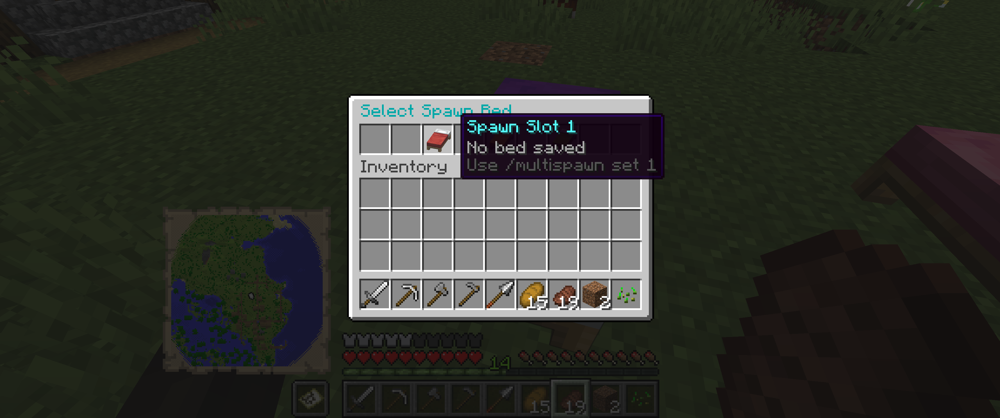
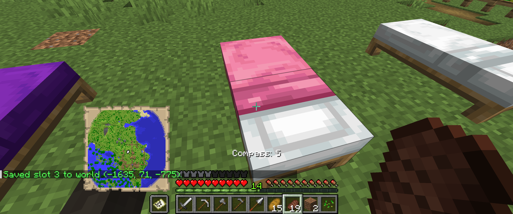

# SKYMultiSpawn (Spigot Plugin)

[](https://adoptium.net/)
[](https://www.spigotmc.org/wiki/spigot-plugin-development/)
[](https://github.com/USMCsky/SKYMultiSpawn_Spigot_Plugin/commits/master)
[](https://github.com/USMCsky/SKYMultiSpawn_Spigot_Plugin)
[](https://github.com/USMCsky)

A lightweight Spigot plugin that lets players save and manage up to **3 different bed spawn points** and choose which one is active for respawn.

Perfect for survival servers where players maintain multiple bases and want control over where they respawn.

---

## Features

- Save up to **3 bed spawn slots** per player
- Choose an **active** spawn slot
- Remove saved slots
- List saved slots with status
- In-game GUI selector (`/multispawn gui`)
- Automatic fallback to another valid saved bed if the active one is missing/broken
- Data persistence in `plugins/SKYMultiSpawn/bed-spawns.yml`

---

## Requirements

- **Minecraft/Spigot API:** `1.21` (as defined in `plugin.yml`)
- **Java:** 21 (recommended based on modern Spigot 1.21 runtime expectations)

---

## Installation

1. Build the plugin:
   ```bash
   mvn clean package
   ```
2. Copy the generated JAR from `target/` into your server’s `plugins/` folder.
3. Start or restart the server.
4. Verify load in console and with:
   ```text
   /plugins
   ```

---

## Player Instructions

### Quick Start

1. Place/own the beds you want to use as spawn points.
2. Look directly at a bed (within 5 blocks) and save it:
   ```text
   /multispawn set 1
   ```
3. Save additional beds into slots 2 and 3:
   ```text
   /multispawn set 2
   /multispawn set 3
   ```
4. Select which saved bed is active:
   ```text
   /multispawn select 2
   ```
5. Die/respawn — the plugin will respawn you at your selected valid bed.

---

### Commands (Players)

- `/multispawn set <1|2|3>`  
  Save the bed you are looking at (or standing on) into the slot.
- `/multispawn select <1|2|3>`  
  Set that saved slot as your active respawn bed.
- `/multispawn remove <1|2|3>`  
  Remove the saved bed from a slot.
- `/multispawn list`  
  Show all 3 slots, including active/empty/missing status.
- `/multispawn gui`  
  Open a GUI and click a saved slot to select it.

Alias:
- `/bedspawn ...`

---

### How Bed Detection Works

`/multispawn set <slot>` works when you are:
- Looking at a bed within 5 blocks, **or**
- Standing on a bed, **or**
- Standing directly above a bed.

If no bed is detected, you’ll get an error message prompting you to look at/stand on a bed first.

---

### Missing or Broken Bed Behavior

If your active saved bed is destroyed or invalid:
- The plugin automatically checks your other saved slots (1 → 3) for a valid bed.
- If found, it switches active slot to that valid bed.
- If none are valid, normal server respawn behavior applies.

---

## Screenshots

### Command Usage Help

Shows the full command list in chat (`set`, `select`, `remove`, `list`, and `gui`) while standing near multiple beds.


### Spawn Selector GUI

The `/multispawn gui` menu displaying spawn slots and their current save status.



### Saving a Bed Slot

Example confirmation message after saving a bed to a slot, including world and coordinates.



---

## Permissions

- `skymultispawn.use`  
  Allows usage of multi-bed spawn commands.  
  **Default:** `true`

---

## Admin Notes

- Main command: `multispawn`
- Data file: `plugins/SKYMultiSpawn/bed-spawns.yml`
- Each player’s data is stored by UUID with:
  - `active-slot`
  - `slots.1..3` containing world/x/y/z

---

## Example Usage Flow

```text
/multispawn set 1
/multispawn set 2
/multispawn list
/multispawn select 2
/multispawn gui
```

---

## Build (Maven)

```bash
mvn clean package
```

Output JAR will be in:
```text
target/
```

---

## Troubleshooting

- **"Only players can use this command."**
  - Run commands in-game as a player (not server console).

- **"Look at a bed within 5 blocks..."**
  - Move closer and aim directly at a bed block, or stand on/above the bed.

- **"Slot X points to a missing or broken bed."**
  - Bed was removed or changed. Re-save the slot with `/multispawn set <slot>`.

- **Respawn didn’t go where expected**
  - Check `/multispawn list` to confirm your active slot and bed validity.

---

## Author

- [USMCsky](https://github.com/USMCsky)
